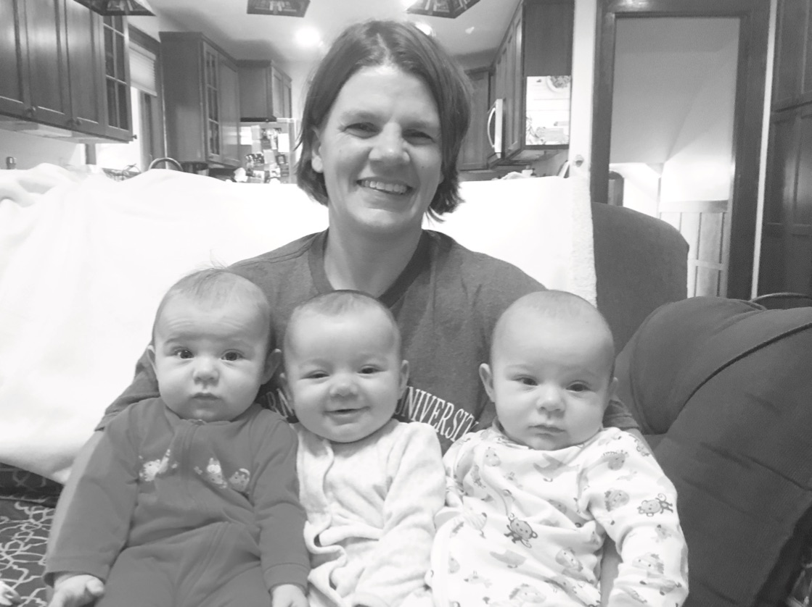

{{}}

After years of study, work and practice, Anne Waltner’s career as a music professor was just taking off. She held the
position of Assistant Professor of Music at Eastern Mennonite University (EMU) in Harrisonburg, Va. She was an
accomplished and soughtafter piano performer and accompanist. While a position at EMU, a small Mennonite university,
might not seem attractive to everyone, for someone like Waltner, who is committed to the institutions of her Mennonite
heritage, it could be seen as the beginning of a long and distinguished career. She would have had peers in every
generation who envied her success.

Then Waltner gave it all up to become a farmer in rural South Dakota. It began with several seasonal summer farming
expeditions renting land on her parent’s farm smack in the middle between the towns of Freeman, Parker, and Hurley.
Then, two years ago, she left her teaching position at EMU to come home for good. Her parents, Keith and Sharon Waltner,
were glad to welcome her home and enter into partnership with her in farming as they near retirement age. Unlike some
young people who want to enter farming, Waltner and her family had both the means and the inclination to make that
possible for her, and Waltner realizes how fortunate she is in that. But still! Imagine giving up the security and the
dream of a career in teaching and music for life on the farm? It isn’t that Waltner doesn’t love music and teaching and
performance anymore.

These endeavors occupied her life as a student and young adult pursuing just that career since she graduated from
Freeman Academy some twenty years ago. As the school year recently began a second time without her, Waltner misses the
classroom, and particularly giving music lessons to wellmotivated students. And as her participation as orchestra
conductor at this past spring’s Schmeckfest confirms, she continues to enjoy music performance as well. So what in the
world motivated Waltner to make this drastic career change as an older young adult? Waltner remembers that every move
she made as a student and in her music career took her further east away from this rural, agrarian landscape where she
had grown up—first from Goshen (Ind.) College to a three-year stint teaching at Woodstock School in India. From there
she completed a master’s degree in Chicago, a doctorate and artist diploma in Cleveland, and assistant professorships in
West Virginia and Virginia. The further away she moved, the more homesick she got for this land that had shaped her. But
farming wasn’t particularly a childhood dream for Waltner. She saw how hard her parents worked on the farm, the long
hours they put in year after year. She knew the challenges and risks of making a living on the land, even with the
advantages she might have to begin with.

Waltner experienced the richness and strength growing up in a rural community provided for her. She grew up in a church
and school and community environment that encouraged her to develop her gifts. The heritage of the community gave her
the sense of identity and the confidence to do that. Her years at Freeman Academy in particular gave her the foundation
for pursuing her dreams. The agrarian culture of the rural community provides a distinct alternative to the dominant
urban culture of American society.

So in the end, Waltner says, she came back to repay or give back or contribute to this rural community. And what else
could someone like her do here but farm? It was the community, in other words, and not farming per se, that drew Waltner
back to the farm, though she is eagerly learning about agriculture as well.

Returning to the larger Freeman community held a number of surprising riches for Waltner. First she met and soon married
Rolf Olson, himself a music educator in the larger area. And then, lo and behold, they were blessed with triplets, girls
born to them in May — Lydia, Alice and Greta. All of this has both complicated and enriched Waltner’s back to the
Freeman community in the past few years.

Working in partnership with her parents in their farming enterprise, Waltner feels keenly the ways in which she is an
apprentice in agriculture, recognizing how much she has to learn and how much the experience of her parents and the
community’s farming heritage have to teach her. While she hasn’t currently begun to make significant changes in the
farming operation, she can envision transferring some components of the conventional operation to alternative practices,
in both row-crop and livestock sectors. She sees value in raising her daughters on a farm with livestock. Rural
communities tend to be traditional and conservative.

Farmers who venture into alternative agricultural production are often scrutinized. Women like Waltner, who manage their
farms without significant assistance from their spouses, often face the same scrutiny. While Waltner has experienced
some of that, she feels greater frustration when her work and vocational pursuit isn’t taken seriously by her community
around her. Now that she is a mother, her choice to continue farming has raised several community eyebrows.
Nevertheless, the “Welcome Home” she has felt has been overwhelmingly positive.

While farming is and will continue to be Waltner’s primary occupation in the future, she hopes to continue playing and
perhaps teaching piano and being involved in the artistic and cultural life of the community. As for the future of a
rural community like Freeman, Waltner is frank to recognize the challenges of ongoing decline in the rural population
and community. She isn’t sure the corner has been turned yet toward a real rural revitalization, but she has come home
to be a part of that when it happens.

After all, it was for the sake of the community that she came home to invest her life in this place. 

Rural Alternatives is a semiregular feature facilitated by Rural Revival, a local organization that focuses on
agricultural sustainability as a way of life in rural America. This author of this piece, S. Roy Kaufman, is a member of
the group and a quarterly Courier columnist.

[Nov 9 2017 Anne Waltner in Courier 1](Nov-9-2017-Anne-Waltner-in-Courier-1.pdf)

[Nov 9 2017 Anne Waltner in Courier 2](Nov-9-2017-Anne-Waltner-in-Courier-2.pdf)

